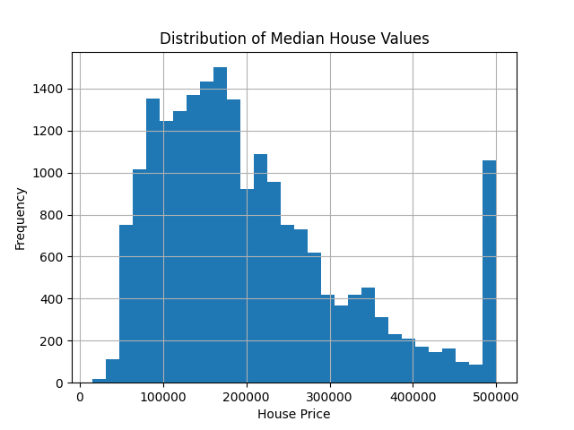

# California Housing Price Prediction

This is a machine learning project that uses simple linear regression, random forest regression, and gradient boosting regression to predict median house values in California census block groups. My data comes from [Kaggle's California Housing Prices Dataset](https://www.kaggle.com/datasets/camnugent/california-housing-prices). 

Overall, we observe random forest regression minimizes mean absolute error (MAE) and maximizes $R^2$, yielding values of $31,629 and 0.817 respectively. 

## Model Variables

### Explanatory Variables (X)
- longitude
- latitude
- housing_median_age
- total_rooms
- total_bedrooms
- population
- households
- median_income
- ocean_proximity

### Response Variable (y)
- median_house_value

### Histogram of `median_house_value`

## Training and Testing

Using `train_test_split()` from sklearn, we randomly assign 80% of observations to the training group and 20% to the testing group. 

For each kind of regression, we use the training data to fit a model. Then, inside the testing group, we apply the model to the features (explanatory variables) to create predictions for `median_house_value`. 

Finally, we compare our predictions to the actual values. We measure the accuracy of our predictions using MAE and $R^2$. 

### $MAE$

$$
MAE = \frac{1}{n}\sum_{i=1}^{n}\left|y_i-\hat{y}_i\right|
$$

MAE is the average distance of the set of prediction values from the actual values. We want MAE to be as low as possible. If MAE = 0, our predictions exactly match the actual values. 

### $R^2$

$$
R^2 = 1 - \frac{\sum_{i=1}^{n}(y_i-\hat{y}_i)^2}{\sum_{i=1}^{n}(y_i-\bar{y})^2} = 1- \frac{RSS}{TSS}
$$

$R^2$ observes how our model stacks up to the baseline of simply guessing the average `median_house_price` each time. If our model produces a closer prediction than this baseline,  $\frac{RSS}{TSS} < 1$ and $R^2 > 0$. $R^2*100$ can be understood as the percent of variability in our response variable that is explained by the model. 

## Linear Regression 

Prior to running our simple linear regression, we standardize our explanatory variables because they range in scale from the tens to the hundreds of thousands. This poses an interpretability problem because a "one unit incease" in one explanatory variable is markedly different than a "one unit increase" in another, so our coefficients are hard to understand. 

After standardizing, though, each coefficient represents the change in `median_house_value` if the corresponding explanatory variable were to increase by *one standard deviation* (holding all other explanatory variables constant). This is because the standard deviation of the standard normal is 1, hence a one unit increase is equivalent to an increase by one standard deviation!

To fit the model, sklearn performs optimization under the hood to determine coefficients that minimize the residual sum of squares. 

More precisely, it finds a vector $\hat{\beta}$ s.t.

$$
\hat{\beta}
=
\arg\min_{\beta}
\sum_{i=1}^{n}(y_i-\hat{y}_i)^2
$$
$$
=\arg\min_{\beta}\sum_{i=1}^{n}
\left(
y_i-\beta_0-\beta_1x_{i1}-\beta_2x_{i2}-\cdots-\beta_px_{ip}
\right)^2
$$

Here, $x_{ip}$ refers to the value corresponding to the pth feature of the ith observation in the training group. 

Below are the coefficients for our model: 

| Feature | Coefficient |
|---|---:|
| longitude | -53,826.65 |
| latitude | -54,415.70 |
| housing_median_age | 13,889.87 |
| total_rooms | -13,094.25 |
| total_bedrooms | 43,068.18 |
| population | -43,403.43 |
| households | 18,382.20 |
| median_income | 75,167.77 |
| ocean_proximity_<1H OCEAN | 6,424.36 |
| ocean_proximity_INLAND | -12,492.69 |
| ocean_proximity_ISLAND | 2,319.63 |
| ocean_proximity_NEAR BAY | 2,459.95 |
| ocean_proximity_NEAR OCEAN | 5,435.01 |

Finally, $MAE =$ $50,671$ and $R^2 = 0.62$

## Random Forest Regression 

Random Forest Regression creates 100 trees. Each tree is distinct because it is built from a sample that is bootstrapped from `X-train`, so it is unlikely any two trees are created from the identical data. Each level of the tree corresponds to a certain feature, with branching thresholds selected so that the y-values in each child node have low variance.  

Each observation in `X-test` is fed through each tree, generating 100 y-values per observation. These y-values are then averaged, resulting in final y-prediction for a certain observation in `X_test`. We do this for each observation in `X-test`, resulting in a final prediction set that can be compared to `y-test`. 

 For our random forest model predictions, our $MAE$ = 31,629$ and $R^2$ = 0.817. 

## Gradient Boosting Regression 

Gradient boosting regression starts with the simple guess of $\bar{y}$.

$$
F_0(x) = \bar{y} = \frac{1}{n}\sum_{i=1}^{n} y_i
$$

For example if `y_train` = [20, 30, 70], we take $\bar{y}$ = 40. 

Next, we calculate the difference between $y_i$ and $\bar{y}$ for each observation in the training block. We store these residuals as a vector. 

Residuals = [-20, -10, 30]

Now, we build a shallow tree (depth of at most 3) that splits our residuals with a threshold that minimizes variance between the child nodes. We average the values in each child node, and this is the output of the tree. Call this first tree function $h_1(x)$. 

In our example, the threshold that reduces RSS is 10. So, for $x \le 10$, $h(x) = \frac{-20 + -10}{2} = -15$. For $x > 10$, $h(x) = 30. 

We use this tree to update our prediction of $\bar{y}$. Our function has a chosen learning rate of $\eta = 0.1$, and this is the proportion we adjust our model by. Generally a smaller learn rate creates more exact predictions, but it also requires more trees. 

For our first adjustment, we have: 

$$
F_1(x) = F_0(x) + \eta h_1(x) 
$$

After this first adjustment, instead of guessing the average of 40 each time, we guess 38.5, 38.5, and 43 respectively. We see this gets us slightly closer to our true values of 20, 30, and 70!

Now, we calculate the new residuals (true values - predictions) and repeat the process. Eventually, our predictions start to look very similar to our true values. 

For this model, our $MAE = 38,250$ and $R^2 = 0.761$. 
